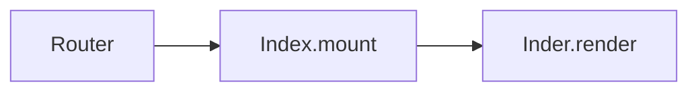
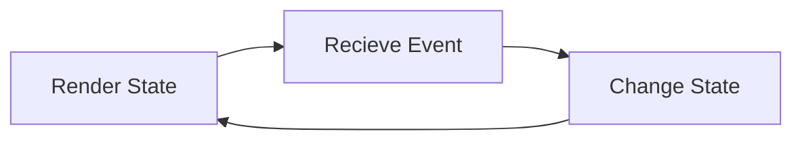

# The LiveView Lifecycle

The LiveView Lifecycle creates a persistent websocket connection between the client and the server.

## Initial request

1. Receive HTTP-request
2. The `mount/3` callback is invoked which assigns initial state to the socket.
3. The `render/1` callback is then invoked with the state that `mount/3` assigned to the socket.
4. A full SEO-friendly HTML-page is sent back to the client as a regular HTTP-response.

## Subsequent requests

1. When the initial page loaded it also loaded `assets/js/app.js` which opens a persistant websocket connection to the server.
2. A stateful LiveView process is spawned. `mount/3` will then be invoked again and initalises the state of the process assigning values to the socket.
3. `render/1` will then be invoked once more to render a new view for the state. However this time it will only send the parts that need updating.
4. The *LiveView Loop* has been started.

Read more at [Phoenix.LiveView behaviour](https://pragmaticstudio.com/tutorials/the-life-cycle-of-a-phoenix-liveview).

## The LiveView Loop

The **LiveView Loop** is one of the core concepts of **Phoenix LiveView**. Instead of managing your application with a traditional request-response model, **LiveView** will manage the state of your application in a long-lived process that will receive events, change the state and render it. This will continue back and forth, forever.

The **LiveView Loop** can be described as simply as *get an event, change the state, render the state and restart the loop*. This simple loop moves the details of the client-server communication from the mind of the developer to the infrastructure.

## State management

LiveView manages **state** in structs that are called **sockets**. The module `Phoenix.LiveView.Socket` creates these structs.

Every live view will keep its state in a **socket** and that state is updated through the `:assigns` map on the **socket**.